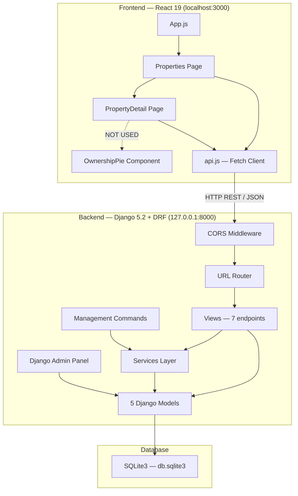
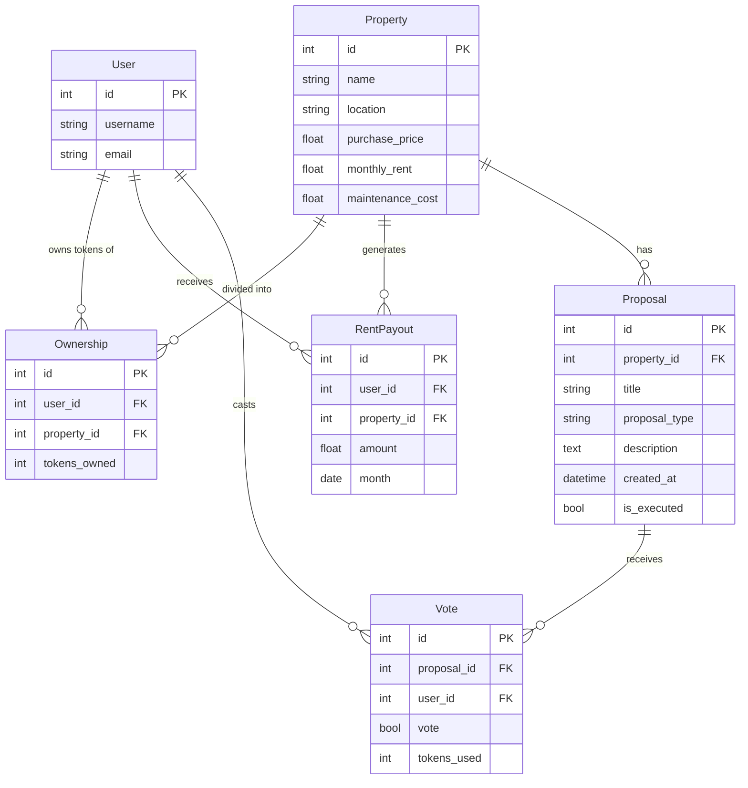
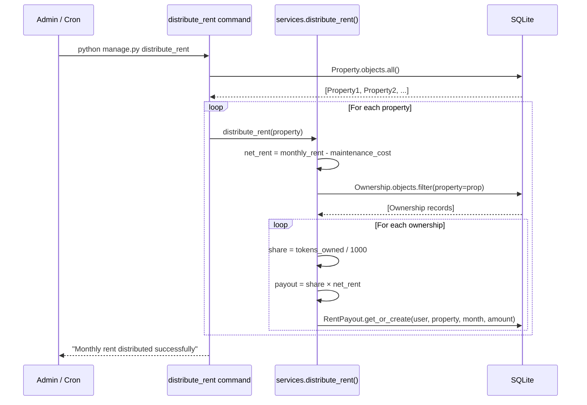
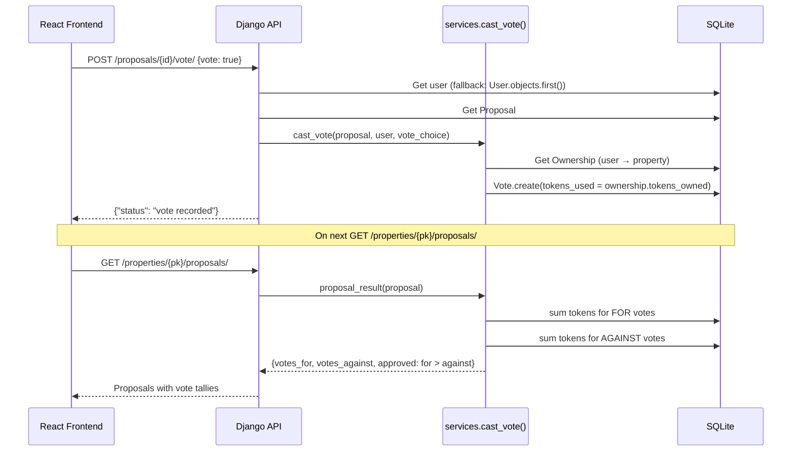
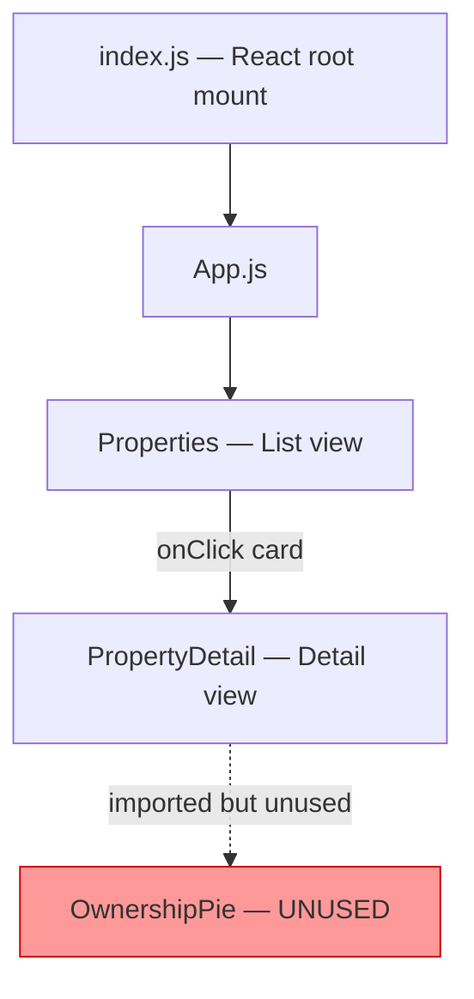

# CoProperty — Architecture Deep Dive

## System Architecture Diagram

---

## Data Model (Entity Relationship)

### Key Constraints
| Constraint | Description |
|-----------|-------------|
| `Ownership.unique_together` | `(user, property)` — One user can own tokens of a property only once |
| `RentPayout.unique_together` | `(user, property, month)` — One payout per user per property per month |
| `Vote.unique_together` | `(proposal, user)` — One vote per user per proposal |
| `TOTAL_TOKENS` | Fixed at 1,000 — hardcoded constant |

---

## API Endpoints

| Method | URL | View Function | Description |
|--------|-----|---------------|-------------|
| `GET` | `/properties/` | `property_list` | List all properties with ROI |
| `GET` | `/properties/<pk>/roi/` | `property_roi` | Get ROI for a specific property |
| `GET` | `/properties/<pk>/ownership/` | `property_ownership` | Get ownership distribution |
| `GET` | `/properties/<pk>/payouts/` | `property_payouts` | Get rent payout history |
| `GET` | `/users/<user_id>/payouts/` | `user_payouts` | Get payouts for a specific user |
| `GET` | `/properties/<pk>/proposals/` | `property_proposals` | Get governance proposals with vote tallies |
| `POST` | `/proposals/<proposal_id>/vote/` | `vote_on_proposal` | Cast a vote on a proposal |

---

## Business Logic Flow

### 1. Rent Distribution Pipeline

### 2. Governance Voting Flow

---

## Frontend Component Tree

### State Management
- **No global state** — each page manages its own state via React `useState` / `useEffect`
- Navigation is implemented via **conditional rendering** (not a router) — `selectedProperty` state toggles between list and detail views

### API Communication
- **Fetch API** (no Axios) — simple wrapper functions in `api.js`
- Base URL: `http://127.0.0.1:8000` (hardcoded)
- No error handling, no loading states, no authentication headers
