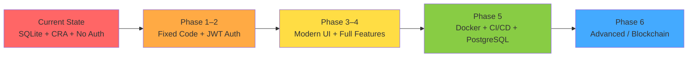

# CoProperty — What Can Be Done: Roadmap & Recommendations

This document outlines **everything that can be done** to take this project from its current MVP/prototype state to a production-ready, feature-rich platform. Items are organized by priority and effort.

---

## Phase 1 — Bug Fixes & Code Cleanup (1–2 days)

> **Goal**: Fix all critical bugs and clean up technical debt before adding features.

| # | Task | File(s) | Effort |
|---|------|---------|--------|
| 1 | Remove duplicate `RentPayout` model (lines 36–43) | `models.py` | 5 min |
| 2 | Remove duplicate `distribute_rent` function (lines 1–17) | `services.py` | 5 min |
| 3 | Remove duplicate `urlpatterns` (lines 20–22) | `core/urls.py` | 2 min |
| 4 | Fix vote race condition (await POST before re-fetching) | `PropertyDetail.js` | 15 min |
| 5 | Change `FloatField` to `DecimalField` for all money fields | `models.py`, `serializers.py` | 30 min |
| 6 | Integrate the unused `OwnershipPie` component | `PropertyDetail.js` | 15 min |
| 7 | Remove dead CRA CSS from `App.css` | `App.css` | 5 min |
| 8 | Use env variable for `API_BASE` URL | `api.js` | 10 min |

---

## Phase 2 — Authentication & Security (3–5 days)

> **Goal**: Secure the platform so users can log in and actions are attributed to the correct user.

| # | Feature | Description |
|---|---------|-------------|
| 1 | **JWT Authentication** | Add `djangorestframework-simplejwt` for token-based auth |
| 2 | **User Registration** | Registration endpoint + React signup form |
| 3 | **Login / Logout** | Login page with JWT token storage |
| 4 | **Protected Endpoints** | Add `IsAuthenticated` permission on all views |
| 5 | **Fix Voting** | Use `request.user` properly now that auth works |
| 6 | **CSRF Protection** | Enable CSRF or use proper token-based auth |
| 7 | **Secret Key Management** | Move `SECRET_KEY` to environment variable |
| 8 | **Disable DEBUG in prod** | Use env-based settings |

---

## Phase 3 — Frontend Overhaul (5–7 days)

> **Goal**: Transform the bare-bones UI into a stunning, professional dashboard.

| # | Feature | Description |
|---|---------|-------------|
| 1 | **React Router** | Proper URL routing (`/properties`, `/properties/:id`, etc.) |
| 2 | **Modern CSS / Design System** | Replace inline styles with a proper design system |
| 3 | **Dashboard Page** | Portfolio overview — total tokens, total payouts, ROI across properties |
| 4 | **Loading States** | Spinner/skeleton screens during API calls |
| 5 | **Error Handling** | Toast notifications for API errors |
| 6 | **Responsive Design** | Mobile-friendly layouts |
| 7 | **Charts Integration** | Use Recharts properly (bar charts for payouts, pie chart for ownership) |
| 8 | **Dark Mode** | Theme toggle |

---

## Phase 4 — Core Feature Expansion (1–2 weeks)

> **Goal**: Complete the co-ownership platform with full token trading and financial features.

| # | Feature | Description |
|---|---------|-------------|
| 1 | **Token Trading** | Buy/sell tokens between users (P2P marketplace) |
| 2 | **Transaction History** | Full log of all token transfers and payouts |
| 3 | **Property CRUD** | Admin or users can add/edit/remove properties via UI |
| 4 | **Payout Dashboard** | Monthly/quarterly payout summaries with charts |
| 5 | **Proposal Creation via UI** | Users can create governance proposals from frontend |
| 6 | **Voting Period / Deadlines** | Time-limited voting periods for proposals |
| 7 | **Proposal Execution** | Auto-execute approved proposals (change rent, etc.) |
| 8 | **Notifications** | Email/in-app notifications for payouts, proposals, votes |
| 9 | **User Profile** | Profile page showing owned tokens, voting history, payout history |
| 10 | **Seed Data Script** | Import `data/properties.json` via management command |

---

## Phase 5 — DevOps & Infrastructure (1–2 weeks)

> **Goal**: Make the project production-ready with proper CI/CD, containerization, and deployment.

| # | Feature | Description |
|---|---------|-------------|
| 1 | **Docker** | Dockerfiles for frontend and backend |
| 2 | **Docker Compose** | Full-stack local dev with PostgreSQL |
| 3 | **PostgreSQL Migration** | Switch from SQLite to PostgreSQL |
| 4 | **CI/CD Pipeline** | GitLab CI — lint, test, build, deploy |
| 5 | **Terraform** | Infrastructure as Code for cloud deployment (AWS/GCP/Azure) |
| 6 | **Nginx Reverse Proxy** | Production web server in front of Django |
| 7 | **Environment Configuration** | `.env` files, `python-decouple` for settings |
| 8 | **Logging & Monitoring** | Centralized logging, Sentry for error tracking |
| 9 | **Automated Testing** | pytest for backend, React Testing Library for frontend |
| 10 | **API Documentation** | Swagger/OpenAPI via `drf-spectacular` |

---

## Phase 6 — Advanced Features (2–4 weeks)

> **Goal**: Differentiate the platform with unique advanced capabilities.

| # | Feature | Description |
|---|---------|-------------|
| 1 | **Smart Contracts Integration** | If moving to blockchain — Ethereum/Polygon for tokenized ownership |
| 2 | **Multi-Currency Support** | Support USD, EUR, INR pricing |
| 3 | **Property Valuation API** | Integration with real-estate APIs for live valuations |
| 4 | **Document Management** | Upload/view property documents (title deeds, agreements) |
| 5 | **KYC Verification** | User identity verification for compliance |
| 6 | **Tax Reporting** | Generate tax reports for rental income |
| 7 | **Audit Trail** | Immutable log of all financial transactions |
| 8 | **Role-Based Access** | Admin, Property Manager, Investor roles |
| 9 | **Multi-Tenancy** | Support multiple communities/organizations |
| 10 | **Analytics Dashboard** | Advanced analytics — ROI trends, market comparisons |

---

## Quick Wins — Highest Impact, Lowest Effort

If you want to make the biggest impact with minimal effort, do these first:

1. ✅ **Fix duplicate code** (5 mins total) — eliminates confusion
2. ✅ **Integrate OwnershipPie chart** (15 mins) — instantly prettier
3. ✅ **Add React Router** (1 hour) — proper navigation, browser back works
4. ✅ **Add JWT auth** (3–4 hours) — makes voting and payouts actually work
5. ✅ **Add loading/error states** (1 hour) — much better UX
6. ✅ **Move to env variables** (30 mins) — production readiness baseline

---

## Architecture Evolution Path

